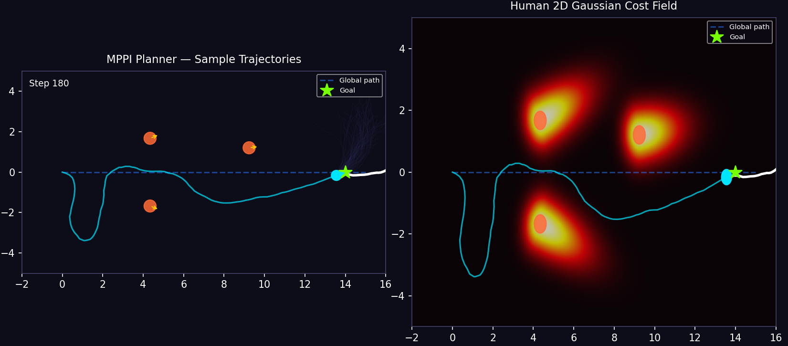
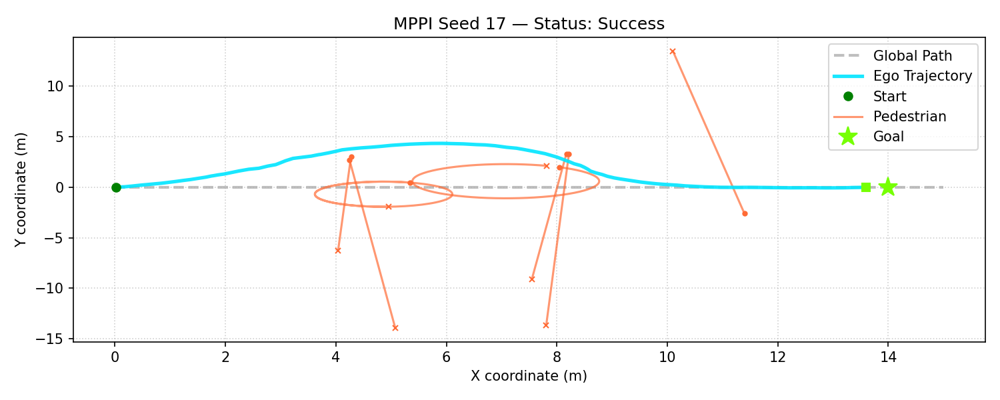
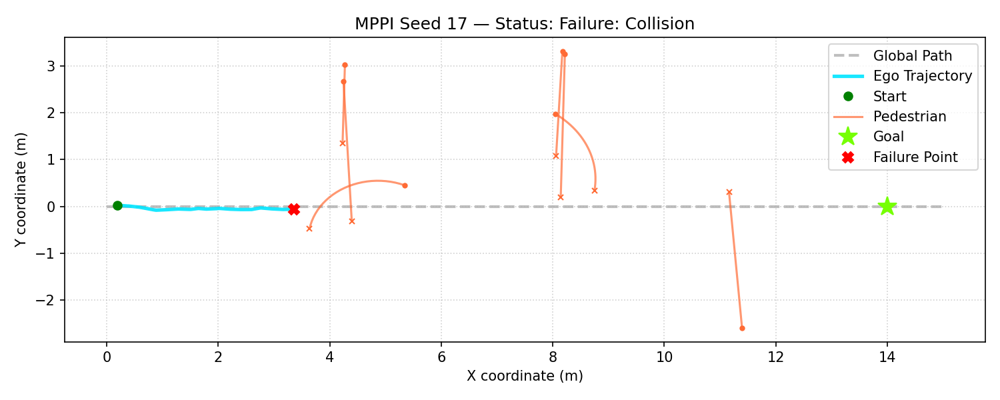

# MPPI Planning with Gaussian Based Human Cost Function for Social Navigation



This repository implements a high-performance **Model Predictive Path Integral (MPPI)** control framework in JAX for non-holonomic robot navigation through dense, dynamic human crowds.

The planner supports two primary modes of pedestrian obstacle avoidance:
1. **Probabilistic Gradient Interaction Field (PGIF) / Gaussian-weighted MPPI (GMPPI)**: Plans trajectories by predicting future human motions and penalizing rollouts via a 2D anisotropic Gaussian cost field elongated along each human's heading vector (motion-cone danger zones).

   

2. **Simple / Vanilla MPPI (VMPPI)**: Treats dynamic pedestrians as static circular obstacles.

   

---


## File Structure

* **`mppi_dynamic_humans.py`**: The core simulation and planning script. Contains:
* **`evaluate_mppi.py`**: Headless batch evaluator. Runs the simulator across $N$ seeds and saves comparative performance metrics (Success, Collision, Timeout, Path Length, and Step Compute Time) to JSON files.
* **`plot_paper_figures.py`**: Reads JSON metrics generated by the evaluator and renders high-quality trajectory figures for each trial alongside aggregated metrics summaries.

---


## Installation & Setup

### Prerequisites
Make sure you have a python virtual environment active. Install the required dependencies:
```bash
pip install numpy matplotlib jax jaxlib
```

---

## Running the Repository

### 1. Interactive Simulation & Visualization
To run a single interactive simulation trail with real-time matplotlib plots:
```bash
python mppi_dynamic_humans.py
```
*Note: This runs in visualization mode. Pressing `q` or closing the plot window will exit.*

### 2. Running the Benchmark Pipeline
To evaluate the success/collision metrics of the planner across 100 seeds:
1. Open `evaluate_mppi.py` and modify the active calls at the bottom to target either the **dynamic cost** or **vanilla static cost** configurations:
   ```python
   # Evaluates Dynamic PGIF MPPI
   evaluate_seeds(num_seeds=100, max_steps=args.max_steps, save_dir="results_medium", use_gaussian_cost=True, difficulty='medium')

   # Evaluates Static/Vanilla MPPI
   evaluate_seeds(num_seeds=100, max_steps=args.max_steps, save_dir="results_medium_vanilla", use_gaussian_cost=False, difficulty='medium')
   ```
2. Run the evaluator:
   ```bash
   python evaluate_mppi.py --max_steps 200
   ```

### 3. Plotting Results
Generate trajectory plots and print quantitative summaries for any results directory (e.g., `results_medium_vanilla`):
```bash
python plot_paper_figures.py results_medium_vanilla
```
The figures will be saved in `results_medium_vanilla/plots/`.
